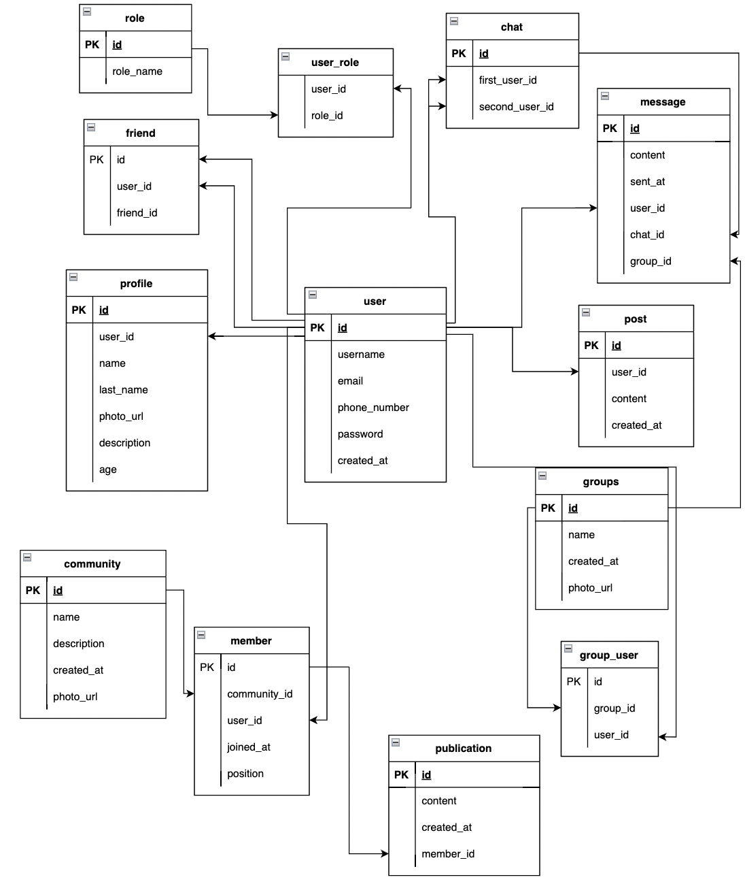

# Social Network
## Инструкция по запуску приложения

Для запуска приложения создайте папку, в которой будет храниться ваш будущий репозиторий, откройте папку в командной строке и вставьте следующую команду:

\```
git clone https://github.com/andrei1910bl/bulavski_andrei_final
\```

После этого на вашем компьютере создастся клон данного репозитория.

Перед запуском следует выполнить миграцию базы данных с помощью команды:
\```
./mvnw flyway:migrate
\```

Для запуска программы выполните команду:
\```
bash build.sh //for Mac/Linux
\```

После этого произойдет сборка, и вам предложат выбор для запуска приложения (Хотите запустить приложение сейчас? (y/n)), отправьте символ y.

Все, поздравляем, сервер запущен! Доступ к серверу вы можете получить по ссылке: http://localhost:8083/

## Схема базы данны:
